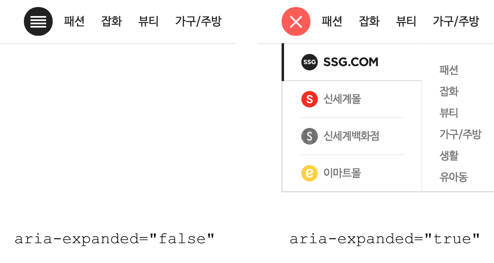
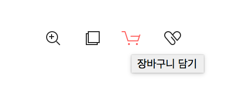
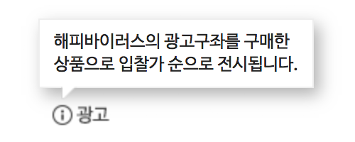

a11y | Accessibility Guidelines 자료 정리

# 웹 접근성 개선
- 카테고리 (Navigation)
- 레이어 팝업 (Modals)
- 툴팁 (Tooltip)

# 카테고리 (Navigation)

## 기존 구현 방식
- 마우스오버 시 하위 메뉴 열림
- 키보드만으로 조작하기 위해 초점 이동 시 동일하게 구현
- Try the [Demo](https://jsfiddle.net/hohoya33/7vynqbh4/embedded/result/dark/).

```js
$('.ctg_mall_lst').on('mouseenter focusin', '.ctg_top_mn', function(e){
    // open sub menu
});
```

## 카테고리 항목이 늘어나면..🤔
스크린리더기에 의존하는 사용자, 마우스를 사용할 수 없는 키보드 사용자에게 이러한 기능은 오히려 더 역효과


## 초점이동 → 컨텐츠 탐색을 위한 이동
초점을 이동 하거나 마우스를 올리는 것은 항상 기능을 실행하기 위한 의도로 보기 어려움
- 의도하지 않은 기능 실행
- 의도하지 않은 정보 인식
- 정보의 선택권 보장 X

## 웹 접근성 지침
<table>
    <colgroup>
    <col style="width:12%">
    <col style="width:88%">
    </colgroup>
    <thead>
        <tr>
            <td>원칙 3</td>
            <td>이해의 용이성</td>
        </tr>
    </thead>
    <tbody>
        <tr>
            <td>3.1</td>
            <td>가독성</td>
        </tr>
        <tr>
            <td>3.1.1</td>
            <td>기본 언어 표시 (주로 사용하는 언어를 명시해야 한다)</td>
        </tr>
        <tr>
            <td style="color:#13DAEC"><strong>3.2</strong></td>
            <td style="color:#13DAEC"><strong>예측 가능성 (콘텐츠의 기능과 실행결과는 예측 가능해야 한다)</strong></td>
        </tr>
        <tr>
            <td style="color:#13DAEC"><strong>3.2.1</strong></td>
            <td style="color:#13DAEC"><strong>사용자 요구에 따른 실행 - 사용자가 의도하지 않은 기능 (새 창, 초점 변화 등)은 실행되지 않아야 한다.</strong></td>
        </tr>
        <tr>
            <td>3.3</td>
            <td>콘텐츠의 논리성 (콘텐츠는 논리적으로 구성해야 한다)</td>
        </tr>
        <tr>
            <td>3.3.1</td>
            <td>...</td>
        </tr>
    </tbody>
</table>

## 접근성 향상
사용자가 의도하지 않는 기능이 자동으로 실행 되지 않도록 개발
- 초점이동 → 기능 실행 NO
- Enter 입력 → 하위 메뉴 확장
- 하위 메뉴 확장/축소 시 적절한 피드백 제공

## WAI-ARIA
- [W3C WAI-ARIA](https://www.w3.org/WAI/standards-guidelines/aria/)는 HTML의 접근성 문제를 보완하는 W3C 명세
- 스크린리더 사용자들이 웹 콘텐츠를 쉽게 이용할 수 있도록 방법을 정의
- HTML 요소에 role 또는 aria-* 속성을 추가
- 콘텐츠의 역할(roles), 상태(states), 속성(properties) 정보를 보조기기에 제공


## WAI-ARIA 참고 사항
role 또는 aria-* 속성을 특정 HTML 요소에 사용할 수 있는지 HTML5 명세를 검토하면서 적용
- HTML 요소에 무분별한 사용 지양
- 대부분 HTML 요소와 속성을 의미 (사용 최소화)
- 사용하기 앞서 HTML5 요소로 대체 할 수 있는지 충분히 검토

```html
<!-- Better: ARIA 역할과 유사한 의미를 가진 고유 HTML 요소를 사용 -->
<nav>...</nav>

<!-- Good -->
<div role="navigation">...</div>

<!-- Bad -->
<nav role="navigation">...</nav>
```

## 카테고리 버튼
- **aria-haspopup="true"** 요소에 팝업 또는 하위 메뉴(컨텍스트 메뉴)를 나타냄
- **aria-expanded="true|false** 해당 메뉴가 열렸는지 닫혔는지 여부를 알 수 있음
- VoiceOver 테스트 [Demo](https://jsfiddle.net/hohoya33/2mfs3a41/embedded/result,js,html/dark/)

```html
<button aria-haspopup="true" aria-expanded="false">
    통합 카테고리 보기
</button>
```
```js
$('button').attr('aria-expanded', 'true'); // 레이어 열기

$('button').attr('aria-expanded', 'false'); // 레이어 닫기
```


## 의미에 맞는 HTML 사용
- a 요소는 Enter 키만으로 실행
- button 요소는 Enter, Space 키로 실행 가능
- 스크린리더 사용자는 a 요소로부터 '버튼' 설명을 듣고 Space 키 사용 시 혼란
- 올바른 HTML의 선택은 사용자 경험과 접근성 측면에서 모두 중요


## 카테고리 레이어
- **aria-hidden="true|false"** 화면에서 숨기면 true, 화면에 표시하면 false
- true 값을 가지면 스크린리더 접근이 불가능 (포커스를 차단하지 않음)
- VoiceOver 테스트 [Demo](https://jsfiddle.net/hohoya33/37ja6u5o/embedded/result,html/dark/)

```html
<div class="ctg_total_layer" aria-hidden="true" style="display:none">
    ...
</div>
```
```js
$('.ctg_total_layer').show().attr('aria-hidden', 'false'); // 레이어 열림

$('.ctg_total_layer').hide().attr('aria-hidden', 'true'); // 레이어 닫힘
```

## 카테고리 메뉴 (depth. 1)
- **aria-label="string"** 간결한 설명
- **role="navigation"** 연결된 페이지를 탐색하기 위한 링크 모음
- 속성을 사용하기 전 HTML5 <nav> 요소를 먼저 고려

```html
<ul class="ctg_mall_lst" role="navigation" aria-label="SSG 통합카테고리">
    <li class="ctg_top_mn">
        <a href="http://www.ssg.com" class="ctg_top_lnk">SSG.COM</a>
    </li>
</ul>
```

## 카테고리 메뉴 이슈
- 두 가지 용도로 사용되는 메뉴
- 해당 메뉴 클릭 시 링크 이동, 마우스 오버 시 하위 메뉴 열림
- 초점 이동 후, Enter 키 입력 시 링크 이동 되는 문제 (하위 메뉴 접근 불가)

## 해결 방법
- 하위 메뉴 열기/닫기 버튼을 별도로 추가 (기본 숨김)
- 키보드 포커스 접근 시 버튼 노출 (탭 키 입력)

## 하위 메뉴 보기 버튼 추가
- a 태그 aria-label 몰 바로가기 설명 추가
- 키보드 포커스 접근 시, 하위 메뉴 보기 버튼 활성화
- VoiceOver 테스트 [Demo](https://jsfiddle.net/hohoya33/dfewLs2x/embedded/result,js,html/dark/)

```html
...
<li class="ctg_top_mn">
    <a aria-label="SSG.COM 바로가기" href="http://www.ssg.com" class="ctg_top_lnk">SSG.COM</a>
    <!-- 하위 메뉴가 있으면 버튼 추가 -->
    <button style="display:none" aria-expanded="false" class="ctg_a11y_btn">
        <span class="blind">SSG.COM 하위 메뉴</span>
    </button>
</li>
```
```js
$('.ctg_mall_lst').on('focusin', '.ctg_top_mn', function(e){
    var welTarget = $(e.currentTarget);
    welTarget.find('>.ctg_a11y_btn').show();
});
```

## 카테고리 하위 메뉴 (depth. 2)
- **role="menubar"** 일반적으로 가로로 표시되는 메뉴 모음
- **role="menu"** 사용자에게 선택 목록을 제공하는 유형 (세로방향)
- **role="menuitem"** menubar 또는 menu 모음에 포함된 옵션 항목
- VoiceOver 테스트 [Demo](https://jsfiddle.net/hohoya33/cqh5v13n/embedded/result,js,html/dark/)

```html
<div class=" ctg_sub_area" aria-hidden="true">
    <ul class="ctg_sub_lst" role="menu">
        <li class="ctg_sub_mn">
            <a role="menuitem" aria-label="패션 바로가기" href="#" class="ctg_sub_lnk">패션</a>
            <button aria-expanded="false" class="ctg_a11y_btn">
                <span class="blind">패션 하위 메뉴 5개의 항목</span>
            </button>
        </li>
    </ul>
</div>
```

## 메뉴 닫기 (Esc key)
사용자가 키보드를 통해 메뉴를 닫을 수 있도록 기능 추가

```js
$('.ctg_total_layer').on('keydown', function(e){
    if (e.keyCode === 27) { // ESC
        var aActiveMenu = $('.ctg_mall_lst').find('li.on');
        var nActive = aActiveMenu.length;

        if (nActive) { //활성화된 메뉴 닫기
            var welCurrentMenu = $(aActiveMenu.get(nActive - 1));
            welCurrentMenu.removeClass('on');
            welCurrentMenu.find('.ctg_a11y_btn').removeClass('on').attr('aria-expanded', 'false');
            welCurrentMenu.find('>a').focus();
        } else { //카테고리 레이어 닫기
            $('.ctg_total_layer').hide().attr('aria-hidden', 'true');
            $('.ctg_open_btn').removeClass('on').attr('aria-expanded', 'false').focus();
        }
    }
});
```

## 최종 결과물
- Try the [Demo](https://jsfiddle.net/hohoya33/3dyozftc/embedded/result,js,html/dark/).


# 레이어 팝업 (Modals)

## 기존 방식
시각적으로는 모든 동작이 명확하고 사용자는 레이어 팝업과 상호작용
- 버튼 클릭 → 레이어 팝업 열림
- 레이어 팝업이 활성화되면 나머지 부분은 일반적으로 흐리게 표시
- 외부 컨텐츠와 상호작용 불가능 (본문 차단)
- 레이어 팝업에 집중
- 작업이 끝나면 레이어 팝업 닫기

## 스크린리더 사용자
모든 사용자가 시각적으로 웹사이트를 볼 수있는 것은 아니므로 접근성 개선 필요
- 버튼 클릭 → 레이어 팝업이 열린다는 정보 인지 불가
- 본문 위 레이어 팝업을 띄웠지만 포커스는 여전히 본문에 위치
- 레이어 팝업 닫기 후, 다음 포커스의 위치
- Try the [Demo](https://jsfiddle.net/hohoya33/tegyap1x/embedded/result/dark/).

## 접근성 향상
- 버튼, 레이어 팝업 → 레이어 팝업을 예측 할 수 있는 적절한 피드백 제공
- 초점의 논리적 이동 → 활성화 시 레이어 팝업 내 포커스 이동, 열려있는 동안 내부에서 포커스 트랩 (외부로 탐색 제한)
- 레이어 팝업 닫기 → 열리기 전 마지막 위치했던 포커스로 이동

## 적절한 의미 제공

### 레이어 팝업 버튼
- **aria-haspopup="dialog"** 요소에 연결되어 있는 팝업(메뉴, 대화상자) 정보를 제공
- [false|true|menu|listbox|tree|grid|dialog] (ARIA 1.1)

```html
<button class="dialog_open" aria-haspopup="true">상품 퀵뷰</button>
```

### 레이어 팝업
- **aria-modal="true|false"** 요소가 모달인지 여부를 나타냄 (ARIA 1.1)
- **aria-labelledby="ID"** 속성을 통해 레이어 팝업 제목을 참조 (설명할 다른 참조 요소가 있을 경우)
- **aria-describedbyon=ID"** 레이어 팝업에 대한 설명을 제공
- <dialog> 요소를 지원하면 role="dialog" 대신 <dialog> 사용 (No support: Safari, Edge Mobile)

```html
<div id="quick_view" role="dialog" aria-modal="true" aria-labelledby="quick_title">
    <div class="dialog_content">
        <h2 id="quick_title">제목입니다.</h2>
    </div>
</div>
```

## 초점의 논리적 이동

### 포커스 제어
기본적으로 div, h1 요소는 초점을 맞출 수 없음. tabindex 속성을 추가하여 포커스 가능

- **tabindex="-1"** 키보드 tab키를 눌러서 초점을 받을 수 없음. 스크립트 focus() 메서드 사용하여 포커스 가능
- **tabindex="0"** 요소에 포커스 가능. DOM 위치에 따라 순서대로 포커스 이동
- **tabindex="1"** 가장 먼저 초점을 받을 수 있음. 그러나 자연스러운 탭 순서를 방해 (안티패턴)
- [tabindex 테스트](https://jsfiddle.net/hohoya33/kmjsd8qb/embedded/result)


### 레이어 팝업 열기
레이어 팝업을 포커스 가능하게 만들고 자바스크립트로 포커스를 지정

```html
<div id="quick_view" role="dialog" aria-modal="true" aria-labelledby="quick_title">

</div>
```
```js
function showModal() {
    $('#quick_view').show().attr('tabindex', '0').focus();
}
```

### 레이어 팝업 닫기
- 레이어 팝업이 닫히면 열기 전 활성화 된 요소로 포커스 반환
- Try the [Demo](https://jsfiddle.net/hohoya33/zdq15wcv/embedded/result,html,js/dark/).

```js
var welLastFocused;

function showModal() {
    // 마지막 포커스된 요소 저장
    welLastFocused = document.activeElement;
    $('#quick_view').show().attr('tabindex', '0').focus();
}
function hideModal() {
    // 마지막 포커스를 얻은 요소로 포커스를 반환
    welLastFocused.focus();
    $('#quick_view').hide().removeAttr('tabindex');
}
```

### 내부에서 포커스 트랩
열린 상태에서 포커스가 밖으로 나갈 수 없도록 레이어 팝업 내부에서 앞 뒤로 포커스를 트랩

```js
function showModal() {
    // ...
    // 활성화 되는 동안 keydown 이벤트, 닫기 시 이벤트 제거
    $('#quick_view').on('keydown', trapTabKey);
}
function trapTabKey(e) {
    var aFocusable = $('#quick_view').find('*').filter('a[href], area[href], input:not([disabled]), select:not([disabled]), textarea:not([disabled]), button:not([disabled]), iframe, object, embed, *[tabindex], *[contenteditable]');
    var firstTabStop = aFocusable[0]; // 첫번째 포커스 요소
    var lastTabStop = aFocusable[aFocusable.length - 1]; // 마지막 포커스 요소

    if (e.keyCode === 9) {
        // 포커스 가능 요소가 없으면
        if (!aFocusable.length) { e.preventDefault(); }

        if (e.shiftKey) { // SHIFT + TAB (이전 포커스)
            if (document.activeElement === firstTabStop) {
                e.preventDefault();
                lastTabStop.focus(); // 마지막 요소로 이동
            }
        } else { // TAB (다음 포커스)
            if (document.activeElement === lastTabStop) {
                e.preventDefault();
                firstTabStop.focus(); // 첫번째 요소로 이동
            }
        }
    }
}
```

### 다른 방법의 포커스 트랩
- Try the [Demo](https://jsfiddle.net/hohoya33/Lp4gh2t9/embedded/result,html,js/dark/).

```html
<div id="quick_view" role="dialog" aria-modal="true" aria-labelledby="quick_title">
    <div id="firstElement" tabindex="0"></div>
    <a id="firstButton" href="#"></a>
    // Content
    <button id="lastButton" class="dialog_close"><span class="blind">퀵뷰 레이어 팝업 닫기</span></button>
    <div id="lastElement" tabindex="0"></div>
</div>
```
```js
$('#lastElement').focusin(function(e) { // 다음 포커스
    $('#firstButton').focus(); // 첫번째 요소로 이동
});
$('#firstElement').focusin(function(e) { // 이전 포커스
    $('#lastButton').focus(); // 마지막 요소로 이동
});
```

### 레이어 팝업 닫기 (Esc key)
사용자가 키보드를 통해 레이어 팝업을 쉽게 닫을 수 있도록 기능 추가

```js
function trapTabKey(e) {
    // ...
    // ESC
    if (e.keyCode === 27) {
        hideModal();
    }
}
```

## 최종 결과물
- Try the [Demo](https://jsfiddle.net/hohoya33/1ugzckyp/embedded/result,html,js/dark/).


# 툴팁 (Tooltip)

## 일반적인 툴팁
- 툴팁은 설명을 위해 사용 (누락된 정보 제공)
- 아이콘을 인식하지 못하거나 해독 할 수 없는 사용자는 정보가 누락
- 대부분의 경우 아이콘과 함께 텍스트를 제공
- 하지만 공간이 부족할 경우 툴팁 사용

## 기본 라벨


가장 먼저 툴팁 텍스트를 보조 기기가 접근 할 수있게 만드는 것
- 툴팁 요소에 role="tooltip" 으로 명시
- aria-labelledby 속성으로 연관된 컨텐츠와 연결

```html
<button aria-labelledby="cart-label"></button>
<div role="tooltip" id="cart-label">장바구니 담기</div>

<!-- 기능상 단순히 텍스트 사용과 유사 -->
<button><span class="blind">장바구니 담기</span></button>
```

## 보조 설명


- aria-describedby 속성으로 연관된 컨텐츠와 연결
- VoiceOver 테스트 [Demo](https://jsfiddle.net/hohoya33/kradcwo1/embedded/result,html/dark/)

```html
<button aria-describedby="ad-desc">광고</button>
<div role="tooltip" id="ad-desc">
    해피바이러스의 광고구좌를 구매한<br>상품으로 입찰가 순으로 전시됩니다.
</div>
```

## 툴팁인척 하는 레이어?!
툴팁에 맞출것인가? 레이팝업에 맞출것인가?

## 작업하면 고민했던 내용
- 툴팁으로 맞추기는 좀.. 툴팁 내용이 너무 많음
- 그렇다고 레이어 팝업으로 대응하기엔 할게 너무 많음, 오버레이 배경 없음
- 포커스가 레이어안에 계속 존재 해야하는가? (포커스 트랩)
- 닫기 버튼은 어디에 위치 시킬것인가?

## 해결 방법
- aria 속성을 이용해 접근성에 맞게 별도로 구성
- 레이어 팝업 (컨텐츠가 body 부분에 위치)과 달리 툴팁 버튼 아래에 내용이 위치 컨텐트의 논리성
- 닫기 버튼을 맨 처음에 위치하면 바로 닫을 수 있음. esc키 닫기 기능 추가 시 어디에 위치해도 상관없음
- 닫기 버튼이 있으면 레이어 종료 시 해당 버튼으로 포커스 이동

## 레이어 형식의 툴팁
- aria-controls="ID" 속성은 현재 요소가 제어하는 대상을 명시
- <button> 요소가 무엇을 제어하는지 명시

```html
<div class="tooltip">
    <!-- aria-haspopup true를 메뉴로 인식 (센스리더), 컨텐츠 영역 포커스시 사용불가로 음성 노출 -->
    <button aria-expanded="false" aria-controls="tooltip-cont" class="tooltip-btn">툴팁 보기</button>

    <div id="tooltip-cont" class="tooltip-content" role="dialog" aria-labelledby="tooltip-cont" aria-hidden="true" tabindex="0">
        <h3>레이어 형식의 제목</h3>
        // content
        <button class="tooltip-close">툴팁 닫기</button>
    </div>
</div>
```

## 최종 결과물
- Try the [Demo](https://jsfiddle.net/hohoya33/k3w78snh/embedded/result,html,js/dark/).


